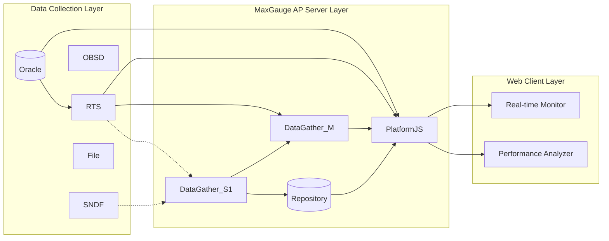

# MaxGauge 설치 자동화 도구

MaxGauge 아키텍처를 기준으로 `Data Collection Layer`, `MaxGauge AP Server Layer`, `Web Client Layer` 흐름을 따라 설치와 패치를 자동화하는 웹 기반 운영 도구입니다.

## 문서 운영 원칙

- 이 프로젝트에서 기능 추가, 동작 변경, 실행 방식 변경, 주요 설정 변경이 발생하면 `README.md`를 함께 업데이트합니다.
- 특히 아래 항목에 영향이 생기면 바로 반영합니다.
  - 실행 방법
  - 환경 변수
  - API 요청/응답 형식
  - 설치/패치 흐름
  - 지원 컴포넌트 및 입력값
  - 변경 이력

## 한눈에 보기

- 백엔드: Python + Flask
- 프론트엔드: React + Vite
- 원격 작업: SSH/SCP 기반
- 주요 기능:
  - 설치 패키지 업로드
  - 원격 서버 자동 설치
  - 컴포넌트별 설치 분기
  - 패치 파일 원격 교체
  - 패치 롤백 (백업 목록 조회 → 날짜 선택 → 원본 복원)
  - 설치 로그 조회

## 레이어 구성

### Data Collection Layer

- Oracle
- RTS
- OBSD
- SNDF
- File

### MaxGauge AP Server Layer

- PlatformJS
- DataGather_M
- DataGather_S1
- Repository

### Web Client Layer

- Real-time Monitor
- Performance Analyzer

## 아키텍처 다이어그램

아래 구조는 현재 UI가 표현하려는 개념 모델입니다.



## 지원 컴포넌트

| 컴포넌트 | agent_type | 추가 입력값 |
| --- | --- | --- |
| RTS | `daemon` | `CONF_NAME`, `MXG_HOME`, `GATHER_IP`, `GATHER_PORT`, `SYS_PASS` |
| PlatformJS | `pjs` | `GATHER_IP`, `GATHER_PORT`, `PJS_PORT`, `DATABASE_TYPE`(oracle/postgres), `DATABASE_USER`, `DATABASE_PASSWORD`, `DATABASE_NAME`(postgres only), `DATABASE_PORT`(postgres only) |
| DataGather_M | `dgm` | `GATHER_PORT`, `SLAVE_GATHER_LIST`, `DATABASE_TYPE`(oracle/postgres), `DATABASE_IP`, `DATABASE_PORT`, `DATABASE_SID`, `DATABASE_USER`, `DATABASE_PASSWORD`, `TABLESPACE`(oracle only), `INDEX_TABLESPACE`(oracle only) |
| DataGather_S1 | `dgs` | (없음) |

공통 입력값:

- Server IP
- SSH Port
- OS 선택
- SSH User
- SSH Password
- Install Path

## 주요 화면 컨셉

- 다이어그램 화면
  - 레이어 단위로 시스템 구조를 보여줍니다.
  - 각 박스를 클릭해서 설치 정보를 입력합니다.
  - 입력값이 바뀌면 관련 정보가 화면에 즉시 반영됩니다.
- 폼 화면
  - RTS, PlatformJS, DataGather_M, DataGather_S1를 카드형으로 나열합니다.
  - 각 카드에서 업로드, 설치, 패치, 로그 확인을 수행합니다.

## 동작 방식

### 1. 설치

1. 사용자가 웹 UI에서 설치 아카이브를 업로드합니다.
2. 백엔드가 파일을 `/tmp/auto_installer_uploads`에 저장합니다.
3. 설치 대상 컴포넌트에 따라 `agent_type`이 결정됩니다.
4. 백엔드가 설치 파일을 해제하거나, 원격 서버로 업로드합니다.
5. 컴포넌트별 설치 실행기가 설치를 진행합니다.
6. 실행 로그를 UI에 반환합니다.

### 2. 패치

1. 사용자가 패치 아카이브를 업로드합니다.
2. 백엔드가 아카이브를 로컬에서 해제합니다.
3. SSH로 원격 서버에 접속합니다.
4. 지정 경로 아래에서 동일한 파일명을 검색합니다.
5. 기존 파일을 `_bakYYMMDD` 형식으로 백업합니다.
6. 새 파일을 업로드하여 교체합니다.

## 실행 흐름

```text
React Frontend
  -> 설치 파일 업로드
  -> 대상 컴포넌트 선택
  -> 설정 입력
  -> 설치 또는 패치 실행 요청

Flask Backend
  -> 업로드 파일 저장
  -> agent_type 분기
  -> 설치기 또는 패치 실행기 호출
  -> 로그 수집 후 응답 반환

Remote Target Server
  -> 파일 업로드
  -> 압축 해제
  -> 설치 스크립트 또는 전용 자동화 로직 수행
```

## 프로젝트 구조

```text
automatic-installer/
|- server.py
|- installer.py
|- requirements.txt
|- .env
|- docker-compose.yml
|- Dockerfile
|- installer/
|  |- archive.py
|  |- prompt.py
|  |- router.py
|  |- agent_daemon.py
|  |- agent_pjs.py
|  |- agent_dgm.py
|  |- agent_dgs.py
|  |- executor_daemon.py
|  |- executor_daemon_linux.py
|  |- executor_daemon_unix.py
|  |- executor_pjs.py
|  |- executor_dgm.py
|  |- executor_patch.py
|- frontend/
|  |- package.json
|  |- vite.config.js
|  |- src/
|     |- App.jsx
|     |- FormPage.jsx
|     |- DiagramPage.jsx
|     |- PatchSection.jsx
|     |- main.jsx
|     |- index.css
```

## 주요 파일 설명

### 백엔드

- [server.py](./server.py)
  - Flask API 진입점입니다.
  - 업로드, 설치, 패치, 자연어 파싱 API를 제공합니다.
- [installer.py](./installer.py)
  - CLI 모드 진입점입니다.
- [installer/router.py](./installer/router.py)
  - 텍스트나 파일명 단서로 설치 대상을 분기합니다.
- [installer/executor_daemon.py](./installer/executor_daemon.py)
  - 일반 설치 흐름과 원격 설치 진입을 담당합니다.
- [installer/executor_pjs.py](./installer/executor_pjs.py)
  - PlatformJS 전용 원격 설치 자동화를 수행합니다.
- [installer/executor_dgm.py](./installer/executor_dgm.py)
  - DataGather_M/S1 계열 설치 자동화를 수행합니다.
- [installer/executor_patch.py](./installer/executor_patch.py)
  - 원격 파일 백업 및 교체 패치를 수행합니다.

### 프론트엔드

- [frontend/src/App.jsx](./frontend/src/App.jsx)
  - 전역 상태와 페이지 전환을 관리합니다.
- [frontend/src/FormPage.jsx](./frontend/src/FormPage.jsx)
  - 카드형 설치 입력 화면입니다.
- [frontend/src/DiagramPage.jsx](./frontend/src/DiagramPage.jsx)
  - 다이어그램 기반 입력 화면입니다.
- [frontend/src/PatchSection.jsx](./frontend/src/PatchSection.jsx)
  - 패치 업로드 및 실행 UI입니다.

## API

### `POST /api/upload`

설치 또는 패치 아카이브 파일을 업로드합니다.

Request:

- `multipart/form-data`
- 필드명: `file`

Response 예시:

```json
{
  "uploaded_path": "/tmp/auto_installer_uploads/rts.tar.gz",
  "filename": "rts.tar.gz"
}
```

### `POST /api/install`

원격 설치를 실행합니다.

Request 예시:

```json
{
  "agent_type": "daemon",
  "tar_path": "/tmp/auto_installer_uploads/rts.tar.gz",
  "host": "10.20.132.101",
  "port": 22,
  "os_choice": "auto",
  "install_path": "/home/MaxGauge",
  "extra_vars": {
    "SSH_USER": "MaxGauge",
    "SSH_PASSWORD": "password",
    "CONF_NAME": "mxg",
    "MXG_HOME": "/home/MaxGauge",
    "GATHER_IP": "10.20.132.40",
    "GATHER_PORT": "7001"
  },
  "install_updater": false
}
```

Response 예시:

```json
{
  "status": "success",
  "message": "Installation successful.",
  "log": "..."
}
```

### `POST /api/patch`

원격 패치를 실행합니다.

Request 예시:

```json
{
  "archive_path": "/tmp/auto_installer_uploads/patch.tar.gz",
  "host": "10.20.132.101",
  "port": 22,
  "ssh_user": "MaxGauge",
  "ssh_password": "password",
  "search_root": "/home/MaxGauge/mxg"
}
```

Response 예시:

```json
{
  "status": "success",
  "message": "패치 완료",
  "log": "..."
}
```

## 환경 변수

현재 코드 기준으로 확인되는 주요 환경 변수:

- `OPENAI_API_KEY`
  - 자연어 설치 파싱에 사용됩니다.
- `GEMINI_API_KEY`
  - 일부 안내 문구와 과거 흐름에 남아 있으므로 현재 코드와 README를 맞춰가며 정리할 필요가 있습니다.
- `VITE_API_BASE_URL`
  - 프론트엔드에서 백엔드 API 주소를 지정할 때 사용합니다.

## 실행 방법

### 1. 백엔드

```bash
python -m venv venv
venv\Scripts\Activate.ps1
pip install -r requirements.txt
python server.py
```

백엔드는 기본적으로 `5050` 포트에서 실행됩니다.

### 2. 프론트엔드

```bash
cd frontend
npm install
npm run dev
```

프론트엔드는 기본적으로 `5173` 포트에서 실행됩니다.

### 3. Docker

```bash
docker-compose up --build
```

## CLI 모드

웹 UI 대신 CLI로도 실행할 수 있습니다.

```bash
python installer.py
```

## 현재 확인된 주의사항

- 기존 README는 인코딩이 깨져 있어 이번에 정리했습니다.
- 코드상 자연어 파싱은 `OPENAI_API_KEY`를 사용하지만, 일부 문서/로그에는 `GEMINI_API_KEY`가 남아 있습니다.
  - 이후 개발 시 이 부분은 문서와 코드 기준을 하나로 맞추는 작업이 필요합니다.
- `docker-compose.yml` 설명 주석 일부도 인코딩이 깨져 있을 수 있습니다.

## 문서 스타일 가이드

앞으로 README는 아래 방향을 유지하면서 업데이트합니다.

- 레이어 구조가 먼저 보이도록 작성
- 컴포넌트 이름은 UI와 동일하게 유지
- 설치 기능 설명보다 시스템 흐름을 먼저 설명
- 다이어그램, 표, 흐름 중심으로 빠르게 읽히게 정리
- 기능 추가 시 변경 이력뿐 아니라 관련 섹션 본문도 함께 갱신

## 변경 이력

| 날짜 | 내용 |
| --- | --- |
| 2026-04-30 | README를 인코딩 깨짐 없는 형태로 전면 정리 |
| 2026-04-30 | README 문서 운영 원칙 추가: 기능/코드 변경 시 README 동시 업데이트 |
| 2026-04-30 | 설치/패치/API/환경 변수/실행 방법 기준으로 문서 구조 재정비 |
| 2026-04-30 | DiagramPage.jsx SVG maxgauge_diagram.html 레퍼런스 기반 전면 재설계: viewBox 780×520, 오픈형 화살표 마커, Oracle/Repository 3D 실린더, 레이어 점선 테두리(#9FE1CB), 노드 파란색(#378ADD)/RTM 초록/PA 보라 배경, diag-svg-area 밝은 배경으로 변경 |
| 2026-05-06 | DataGather_S1 추가 입력값에서 GATHER_PORT 제거 — GATHER_PORT는 DataGather_M에서만 입력받도록 변경 |
| 2026-05-07 | DataGather_M 입력 폼 확장: DB 타입(oracle/postgres) 셀렉터, DB IP/Port/SID/User/Password, Slave Gather List, Tablespace/Index Tablespace(oracle 선택 시에만 표시) 추가 |
| 2026-05-07 | PlatformJS 입력 폼 확장: DB 타입(oracle/postgres) 셀렉터, DB User/Password/SID/Port, Tablespace/Index Tablespace(oracle 선택 시에만 표시) 추가 |
| 2026-05-15 | 패치 롤백 기능 추가: `installer/executor_rollback.py` 신규, `/api/rollback/list` · `/api/rollback/run` 엔드포인트 추가, 패치 탭 내 백업 목록 조회 및 롤백 실행 UI 추가 |
| 2026-05-18 | DataGather_S 다중 인스턴스(S2+) 동적 추가/제거 지원, S1은 DGM 설치 시 자동 생성으로 변경, 다이어그램 버스 라인 토폴로지 적용 |
| 2026-05-18 | RTS(daemon) 폼에서 Install Path 필드 제거 — MXG_HOME 값으로 자동 대체 |
